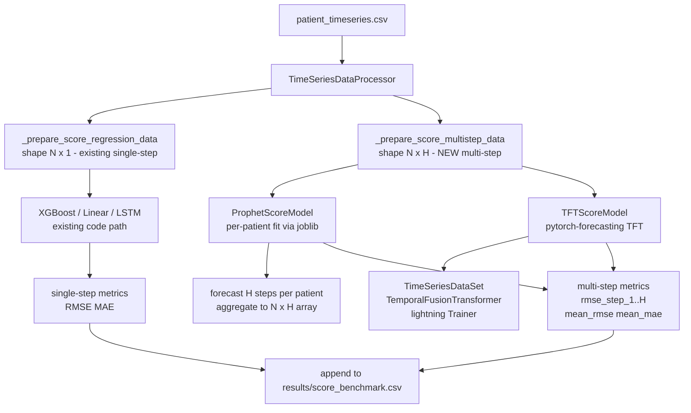

# Prophet + TFT Multi-Step Score Prediction — Design Plan

## Objective

Add two new forecasting models that predict the **next H score values** (not a single mean) from a sliding observation window, using the same SOFA/SIRS/NEWS2 target columns:

- **Prophet** (`src/prophet_model.py`) — per-patient time-series fitting with joblib parallelism
- **TFT** (`src/tft_model.py`) — `TemporalFusionTransformer` via `pytorch-forecasting`

Both output shape `(N, H)` — one predicted score per future timestep.

---

## Architecture



---

## 1. `pyproject.toml` — new dependencies

```toml
"prophet>=1.1.5",
"pytorch-forecasting>=1.3.0",
"lightning>=2.0.0",
"joblib>=1.4.0",
```

> `pytorch` is already present. `joblib` ships with scikit-learn but adding explicitly ensures version control.

---

## 2. `src/data_processor.py` — new method

### `_prepare_score_multistep_data(df, score_col) -> Tuple[np.ndarray, np.ndarray]`

Same sliding-window loop as `_prepare_score_regression_data()` **except** the target is the full future sequence, not its mean:

```python
# Instead of:
future_score = future_window[score_col].mean()          # scalar
targets.append(future_score)

# Use:
future_seq = future_window[score_col].values            # shape (H,)
targets.append(future_seq)
```

Returns:
- `X`: `np.ndarray` shape `(N, window_size, n_features)`
- `y`: `np.ndarray` shape `(N, prediction_horizon)` — dtype `float32`

**Dispatch**: wire into `prepare_data()` by checking a new `multistep: bool` attribute on the processor, **or** expose as a separate public method `prepare_multistep_data(df)` called explicitly by `benchmark.py` for `prophet`/`tft` model types (cleaner, avoids changing existing call sites).

Use `prepare_multistep_data()` — no changes to existing `prepare_data()` call sites.

---

## 3. `src/prophet_model.py` — new file

### Class: `ProphetScoreModel`

```
ProphetScoreModel
├── __init__(prediction_horizon=6, n_jobs=-1, prophet_kwargs={})
│     — stores H, n_jobs, prophet_kwargs (seasonality, changepoint priors, etc.)
│     — self._models: Dict[stay_id -> fitted Prophet]
│
├── fit(train_df, score_col, timestep_col='timestep', stay_id_col='stay_id')
│     — groups by stay_id
│     — per patient: build ds/y DataFrame (ds = base_date + pd.to_timedelta(timestep,'h'))
│     — joblib.Parallel(n_jobs=n_jobs)(delayed(_fit_one_patient)(group, score_col) for ...)
│     — stores fitted models in self._models
│
├── predict(val_df, score_col) -> np.ndarray shape (N_patients, H)
│     — for each val patient: call model.predict(future) for H steps ahead last_timestep+1..+H
│     — stack into (N, H) array
│     — patients with no fitted model get NaN row (warn)
│
└── _fit_one_patient(group_df, score_col, prophet_kwargs) -> fitted Prophet  [module-level for joblib pickling]
```

**Fit signature** accepts raw DataFrames (not `(N,T,F)` arrays) — this is by design. The `benchmark.py` code path for Prophet skips the `_prepare_score_multistep_data()` call and passes `train_df` / `val_df` directly.

**Evaluation unit**: per-patient last-H-steps prediction vs actual. One `(H,)` prediction per patient, stacked to `(N_val_patients, H)`.

---

## 4. `src/tft_model.py` — new file

### Class: `TFTScoreModel`

```
TFTScoreModel
├── __init__(prediction_horizon=6, window_size=6, max_epochs=30,
│            hidden_size=32, attention_head_size=4, dropout=0.1,
│            learning_rate=1e-3, batch_size=64, n_workers=4)
│
├── fit(train_df, val_df, score_col, feature_cols, ...)
│     — builds pytorch_forecasting.TimeSeriesDataSet:
│         group_ids=['stay_id']
│         time_idx='timestep'
│         target=score_col
│         max_encoder_length=window_size
│         max_prediction_length=prediction_horizon
│         time_varying_unknown_reals=feature_cols
│         time_varying_known_reals=[]
│     — creates DataLoaders
│     — instantiates TemporalFusionTransformer from dataset
│     — trains with lightning.Trainer(max_epochs=max_epochs, accelerator='auto')
│
├── predict(val_df) -> np.ndarray shape (N_windows, H)
│     — runs trainer.predict(dataloaders=val_dataloader)
│     — unpacks TFT output (quantile index 0 = median by default)
│     — returns (N, H) float32 array
│
└── attention_weights() -> dict   (TFT variable importance dict from best model)
```

**TFT dataset column requirements**:
- The raw DataFrame must have `stay_id` (int), `timestep` (int, contiguous per patient), and all feature columns.
- The `TimeSeriesDataSet` handles internal scaling; external `StandardScaler` normalization is **skipped** for TFT (it normalizes internally via `target_normalizer=GroupNormalizer`).

---

## 5. `src/benchmark.py` — changes

### New CLI args

```
--model_type            add choices: prophet, tft  (no default change)
--tft_max_epochs        int   default 30
--tft_hidden_size       int   default 32
--tft_attention_heads   int   default 4
--tft_dropout           float default 0.1
--tft_batch_size        int   default 64
```

### New function: `evaluate_model_multistep(targets, preds)`

```python
def evaluate_model_multistep(targets: np.ndarray, preds: np.ndarray) -> dict:
    """
    targets, preds: shape (N, H)
    Returns dict with rmse_step_1..H, mae_step_1..H, mean_rmse, mean_mae
    """
```

### Code path in `run_benchmark()`

```python
if model_type in ('prophet', 'tft'):
    # --- multi-step path ---
    # Prophet: fit/predict on raw train_df / val_df directly
    # TFT:     fit on raw DFs, outputs (N, H)
    # evaluate with evaluate_model_multistep()
    # save per-step metrics columns to CSV
else:
    # --- existing single-step path (unchanged) ---
```

### Result CSV columns for multi-step models

```
task, model_type, prediction_horizon,
train_mean_rmse, train_mean_mae,
train_rmse_step_1, ..., train_rmse_step_6,
val_mean_rmse, val_mean_mae,
val_rmse_step_1, ..., val_rmse_step_6,
run_tag, timestamp
```

---

## Execution order for implementation

1. `pyproject.toml` — add deps, run `uv sync`
2. `data_processor.py` — add `prepare_multistep_data()` + `_prepare_score_multistep_data()`
3. `src/prophet_model.py` — new file
4. `src/tft_model.py` — new file
5. `benchmark.py` — new args + multi-step code path + `evaluate_model_multistep()`

---

## Usage examples

```bash
DATA=processed_files/patient_timeseries_2026-06-11-17-23-43_balanced.csv

# Prophet — sofa_score, 6-step horizon, all CPUs
uv run src/benchmark.py \
  --task sofa_score --model_type prophet \
  --prediction_horizon 6 --data_path $DATA \
  --output_csv results/score_benchmark.csv --run_tag "prophet_h6"

# TFT — sofa_score, 6-step horizon
uv run src/benchmark.py \
  --task sofa_score --model_type tft \
  --prediction_horizon 6 --data_path $DATA \
  --tft_max_epochs 30 --tft_hidden_size 32 \
  --output_csv results/score_benchmark.csv --run_tag "tft_h6"
```
