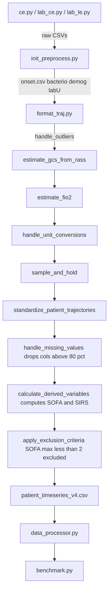
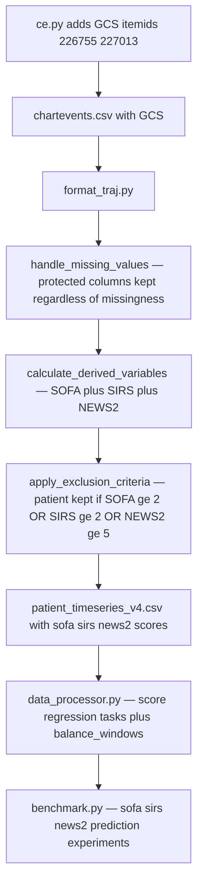

# Plan: Multi-Score Prediction with Balanced Database

> **Last updated:** Root cause of near-100 % risk-score rates identified and fixed (2026-06-12).
> See **Root Cause & Fix** section below.

---

## Root Cause & Fix (Added 2026-06-12)

### Problem

Running the pipeline with any `--noise_ratio` value (including 0.20) still produced:

```
sofa_risk   100.0 %
news2_risk   98.3 %
sirs_risk    88.3 %
sepsis_flag  99.4 %
```

**Root cause:** [`init_preprocess.py find_infection_onset()`](src/init_preprocess.py:160) outputs
`onset.csv` which contains **only patients who satisfied the Sepsis-3 ABx + culture criterion**.
All three `format_traj*.py` pipelines then iterate exclusively over `onset.csv`, meaning the
entire processed dataset is pre-selected infected patients. The `ineligible_stays` pool inside
[`apply_exclusion_criteria()`](src/format_traj.py:1003) is therefore near-empty regardless of
`noise_ratio`, so no real negative examples can be injected.

### Fix (implemented)

| File | Change |
|------|--------|
| [`src/init_preprocess.py`](src/init_preprocess.py) | After `find_infection_onset()`, compute the complement set from `demog` and save `non_onset.csv` (time anchor = `intime + 24 h`). Return value updated to include `non_onset`. |
| [`src/format_traj.py`](src/format_traj.py) | `load_processed_files()` loads `non_onset.csv`. `parse_args()` gains `--non_onset_cap`. `main()` processes both onset and non-onset cohorts through the identical measurement pipeline and concatenates before `apply_exclusion_criteria()`. |
| [`src/format_traj_polars.py`](src/format_traj_polars.py) | Same three changes as `format_traj.py`. |
| [`src/format_traj_gpu.py`](src/format_traj_gpu.py) | Same three changes as `format_traj.py`. |

After the fix:
- `ineligible_stays` pool contains ~55 k genuine control patients
- `apply_exclusion_criteria()` + `noise_ratio` operate as designed
- Score risk percentages will reflect true clinical prevalence (~30–60 % depending on threshold)

---

## Goal

Extend the MIMIC-sepsis pipeline so the processed dataset can be used to predict **SOFA**, **SIRS**, and **NEWS2** scores—ensuring every parameter required by each score is retained, the patient cohort is no longer gated on SOFA alone, and the resulting dataset is balanced for ML training.

---

## Current Pipeline Overview



---

## Problems to Fix

| # | Problem | Impact |
|---|---------|--------|
| 1 | GCS item IDs 226755 and 227013 are listed in comments of [`ce.py`](src/ce.py:94) but **not** in the SQL `WHERE` clause | GCS is absent from chartevents; the score relies on fallback RASS imputation only |
| 2 | [`handle_missing_values()`](src/format_traj.py:677) drops **any column** with >80% missingness — including score-critical params like `arterial_co2_pressure`, `wbc`, `bilirubin_total` | Score parameters silently disappear before scores are computed |
| 3 | [`apply_exclusion_criteria()`](src/format_traj.py:908) uses SOFA-only gate — excludes all patients where `max(sofa_score) < 2` | Patients detectable only via SIRS or NEWS2 are lost |
| 4 | NEWS2 score is **never computed** — only SOFA and SIRS exist in [`calculate_derived_variables()`](src/format_traj.py:745) | Cannot predict NEWS2 |
| 5 | No class-balancing logic in [`data_processor.py`](src/data_processor.py) | Imbalanced classes cause biased models |
| 6 | Score regression tasks (`sofa_score`, `sirs_score`, `news2_score`) not defined in [`TimeSeriesDataProcessor`](src/data_processor.py:8) | Cannot benchmark score prediction directly |

---

## Required Parameters per Score

### SOFA
| Parameter | Source | Status |
|-----------|--------|--------|
| `pf_ratio` | derived from `arterial_o2_pressure` / `fio2` | computed in pipeline |
| `arterial_o2_pressure` | labs_ce / labs_le | present |
| `fio2` | chartevents (itemid 223835) | present |
| `mechvent` | mechvent.csv | present |
| `platelets` | labs | present |
| `bilirubin_total` | labs | present — but may be dropped by missing threshold |
| `map` | chartevents | present |
| `vaso_median` / `vaso_max` | vaso.csv | present |
| `gcs` | chartevents (226755, 227013) | **MISSING from SQL query** |
| `creatinine` | labs | present |
| `uo_step` | uo.csv | present |

### SIRS
| Parameter | Source | Status |
|-----------|--------|--------|
| `temp_C` / `temp_F` | chartevents | present |
| `heart_rate` | chartevents | present |
| `respiratory_rate` | chartevents | present |
| `arterial_co2_pressure` | labs | present — but may be dropped by missing threshold |
| `wbc` | labs | present — but may be dropped by missing threshold |

### NEWS2
| Parameter | Source | Status |
|-----------|--------|--------|
| `respiratory_rate` | chartevents | present |
| `spo2` | chartevents | present |
| `oxygen_flow` | chartevents | present |
| `fio2` | chartevents | present |
| `oxygen_flow_device` | chartevents | present |
| `sbp_arterial` | chartevents | present |
| `heart_rate` | chartevents | present |
| `gcs` | chartevents (226755, 227013) | **MISSING from SQL query** |
| `richmond_ras` | chartevents (228096) | present (used as GCS fallback) |
| `temp_C` / `temp_F` | chartevents | present |

---

## Step-by-Step Changes

### Step 1 — Fix GCS Extraction in `ce.py`

**File:** [`src/ce.py`](src/ce.py:94)

Add GCS item IDs `226755` and `227013` to the SQL `WHERE` clause:

```sql
-- current last line of itemid list:
224700, 224686, 224684, 224421, 224687, 224697, 224695, 224696)

-- change to:
224700, 224686, 224684, 224421, 224687, 224697, 224695, 224696,
226755, 227013)   -- GCS Eye Opening / Total
```

Also add GCS to the measurement_mappings.json reference file so `code_to_concept` maps it to the concept name `gcs`.

> **Note:** Re-running `ce.py` requires a live MIMIC-IV database connection to regenerate `chartevents.csv`. If the processed file already exists, the mapping JSON update alone is sufficient.

---

### Step 2 — Protect Score-Critical Columns from Dropping

**File:** [`src/format_traj.py`](src/format_traj.py:677) — `handle_missing_values()`

Define a `PROTECTED_SCORE_COLS` set at the module level:

```python
PROTECTED_SCORE_COLS = {
    # SOFA
    'arterial_o2_pressure', 'fio2', 'mechvent', 'platelets',
    'bilirubin_total', 'map', 'gcs', 'creatinine',
    # SIRS
    'temp_C', 'temp_F', 'heart_rate', 'respiratory_rate',
    'arterial_co2_pressure', 'wbc',
    # NEWS2 extras
    'spo2', 'oxygen_flow', 'oxygen_flow_device', 'sbp_arterial', 'richmond_ras',
}
```

Modify the column-drop logic: protected columns are **never dropped** regardless of missingness — they are instead subjected to KNN imputation:

```python
# Replace:
cols_to_keep = miss[miss < missing_threshold].index.tolist()

# With:
cols_to_keep = [
    col for col in miss.index
    if miss[col] < missing_threshold or col in PROTECTED_SCORE_COLS
]
```

---

### Step 3 — Add NEWS2 Score Computation

**File:** [`src/format_traj.py`](src/format_traj.py:745) — `calculate_derived_variables()`

Append NEWS2 computation after the existing `sirs_score` block. NEWS2 scoring table:

| Parameter | 3 | 2 | 1 | 0 | 1 | 2 | 3 |
|-----------|---|---|---|---|---|---|---|
| Resp rate | ≤8 | — | 9-11 | 12-20 | — | 21-24 | ≥25 |
| SpO2 (scale 1) | ≤91 | 92-93 | 94-95 | ≥96 | — | — | — |
| O2 supplementation | — | Yes | — | No | — | — | — |
| Systolic BP | ≤90 | 91-100 | 101-110 | 111-219 | — | — | ≥220 |
| Heart rate | — | ≤40 | 41-50 | 51-90 | 91-110 | 111-130 | ≥131 |
| Consciousness | — | — | — | Alert | — | — | CVPU |
| Temperature | ≤35.0 | — | 35.1-36.0 | 36.1-38.0 | 38.1-39.0 | ≥39.1 | — |

Consciousness is mapped from `gcs`: Alert = GCS 15, CVPU (confused/voice/pain/unresponsive) = GCS < 15 → +3 points.

The function computes `news2_score` as integer sum of all sub-scores and adds it to the DataFrame.

---

### Step 4 — Revise Exclusion Criteria to Multi-Score Eligibility + Noise Injection

**File:** [`src/format_traj.py`](src/format_traj.py:908) — `apply_exclusion_criteria()`

Replace the SOFA-only non-sepsis gate with a two-cohort approach:

```python
# REPLACEMENT:
max_scores = df.groupby('stay_id').agg(
    max_sofa=('sofa_score', 'max'),
    max_sirs=('sirs_score', 'max'),
    max_news2=('news2_score', 'max'),
)

# Patients who meet AT LEAST ONE threshold → primary cohort
eligible_mask = (
    (max_scores['max_sofa'] >= 2) |
    (max_scores['max_sirs'] >= 2) |
    (max_scores['max_news2'] >= 5)
)
eligible_stays   = max_scores[eligible_mask].index.values
ineligible_stays = max_scores[~eligible_mask].index.values

# Inject a controlled fraction of zero-score patients as noise
noise_n = max(1, int(len(eligible_stays) * noise_ratio))
rng = np.random.default_rng(42)
noise_stays = rng.choice(ineligible_stays,
                         size=min(noise_n, len(ineligible_stays)),
                         replace=False)

keep_stays = np.concatenate([eligible_stays, noise_stays])
df = df[df['stay_id'].isin(keep_stays)]

excluded_counts['no_score_threshold'] = len(ineligible_stays) - len(noise_stays)
excluded_counts['noise_injected'] = len(noise_stays)
```

**New CLI argument added to `parse_args()` in all three format_traj files:**
```
--noise_ratio FLOAT   Fraction of non-scoring patients to inject as noise
                      relative to the primary cohort size (default: 0.10)
```

NEWS2 threshold of 5 = "medium clinical risk" (standard NEWS2 escalation threshold).

---

### Step 5 — Add Class-Balancing to `data_processor.py`

**File:** [`src/data_processor.py`](src/data_processor.py:8)

Add a `balance_windows()` method to `TimeSeriesDataProcessor` using `imbalanced-learn`:

```python
from imblearn.over_sampling import SMOTE
from imblearn.under_sampling import RandomUnderSampler
from imblearn.pipeline import Pipeline as ImbPipeline

def balance_windows(
    self,
    features: np.ndarray,
    targets: np.ndarray,
    strategy: str = 'combined',   # 'oversample', 'undersample', 'combined'
    sampling_ratio: float = 0.5,
) -> Tuple[np.ndarray, np.ndarray]:
    """
    Balance class distribution across extracted windows.
    Flattens 3D (n, timesteps, feats) → 2D for resampling, then reshapes back.
    """
```

For regression score tasks (sofa, sirs, news2), balancing is replaced by **score-stratified sampling** — bin the continuous score into deciles and under-sample the dominant bin.

Inject `balance_windows()` as an optional step in `prepare_data()` via a `balance=True` constructor parameter.

---

### Step 6 — Add Score Prediction Tasks to `TimeSeriesDataProcessor`

**File:** [`src/data_processor.py`](src/data_processor.py:27)

Add three new branches in `prepare_data()`:

```python
elif self.task == 'sofa_score':
    return self._prepare_score_regression_data(df, 'sofa_score')
elif self.task == 'sirs_score':
    return self._prepare_score_regression_data(df, 'sirs_score')
elif self.task == 'news2_score':
    return self._prepare_score_regression_data(df, 'news2_score')
```

Add `_prepare_score_regression_data()` which uses sliding windows (same as septic_shock) but returns the **future score value** (float) rather than a binary onset flag. Optionally binarise into high/low risk via a threshold argument for classification benchmarks.

---

### Step 7 — Update `benchmark.py`

**File:** [`src/benchmark.py`](src/benchmark.py:256)

1. Add `sofa_score`, `sirs_score`, `news2_score` to `tasks` dict with type `'temporal'`.
2. Set `task_type = 'regression'` for score tasks in the `task_type` determination block:
   ```python
   task_type = 'regression' if task in [
       'los', 'sofa_score', 'sirs_score', 'news2_score'
   ] else 'classification'
   ```
3. Add `--balance` CLI flag that passes `balance=True` to `TimeSeriesDataProcessor`.

---

## Data Flow After Changes



---

## Files to Modify

| File | Change Type | Scope |
|------|-------------|-------|
| [`src/ce.py`](src/ce.py) | SQL fix | Add GCS itemids 226755 and 227013 to WHERE clause |
| [`src/ReferenceFiles/measurement_mappings.json`](src/ReferenceFiles/) | Config update | Add GCS concept mapping for codes 226755 and 227013 |
| [`src/format_traj.py`](src/format_traj.py) | Logic changes | PROTECTED_SCORE_COLS; handle_missing_values; NEWS2 in calculate_derived_variables; multi-score apply_exclusion_criteria; --balance flag in parse_args |
| [`src/format_traj_gpu.py`](src/format_traj_gpu.py) | Logic changes (identical) | Same 4 changes as format_traj.py — handle_missing_values (line 736); calculate_derived_variables (line 813); apply_exclusion_criteria (line 982); parse_args (line 23) |
| [`src/format_traj_polars.py`](src/format_traj_polars.py) | Logic changes (identical) | Same 4 changes as format_traj.py — handle_missing_values (line 793); calculate_derived_variables (line 875); both apply_exclusion_criteria copies (lines 1037 and 1477); parse_args (line 32) |
| [`src/data_processor.py`](src/data_processor.py) | New methods | balance_windows; _prepare_score_regression_data; three new task branches |
| [`src/benchmark.py`](src/benchmark.py) | Config + flag | Add score tasks to task dict; add --balance flag |

---

## Dependency Requirements

Add to project requirements (if not already present):
- `imbalanced-learn>=0.11` — for `SMOTE` and `RandomUnderSampler`

---

## Notes & Caveats

- **GCS re-extraction:** Adding GCS itemids to `ce.py` only helps if `chartevents.csv` is regenerated from MIMIC-IV. If working from a frozen export, the existing RASS→GCS fallback in [`estimate_gcs_from_rass()`](src/format_traj.py:236) remains the primary source.
- **NEWS2 SpO2 scale:** NEWS2 defines two SpO2 scales (scale 1 for standard; scale 2 for hypercapnic respiratory failure). Without a clinical flag for scale selection, this plan uses **scale 1** as default.
- **Balancing strategy for time-series:** SMOTE operates on flattened feature vectors (window × feature). This is an approximation; for production, consider SMOTE-NC or time-series-specific methods. The `strategy` parameter lets callers choose undersampling (safer) vs oversampling.
- **Score thresholds for exclusion:** The NEWS2 threshold of ≥5 and SIRS threshold of ≥2 are clinically standard. Adjust via CLI args in future.
