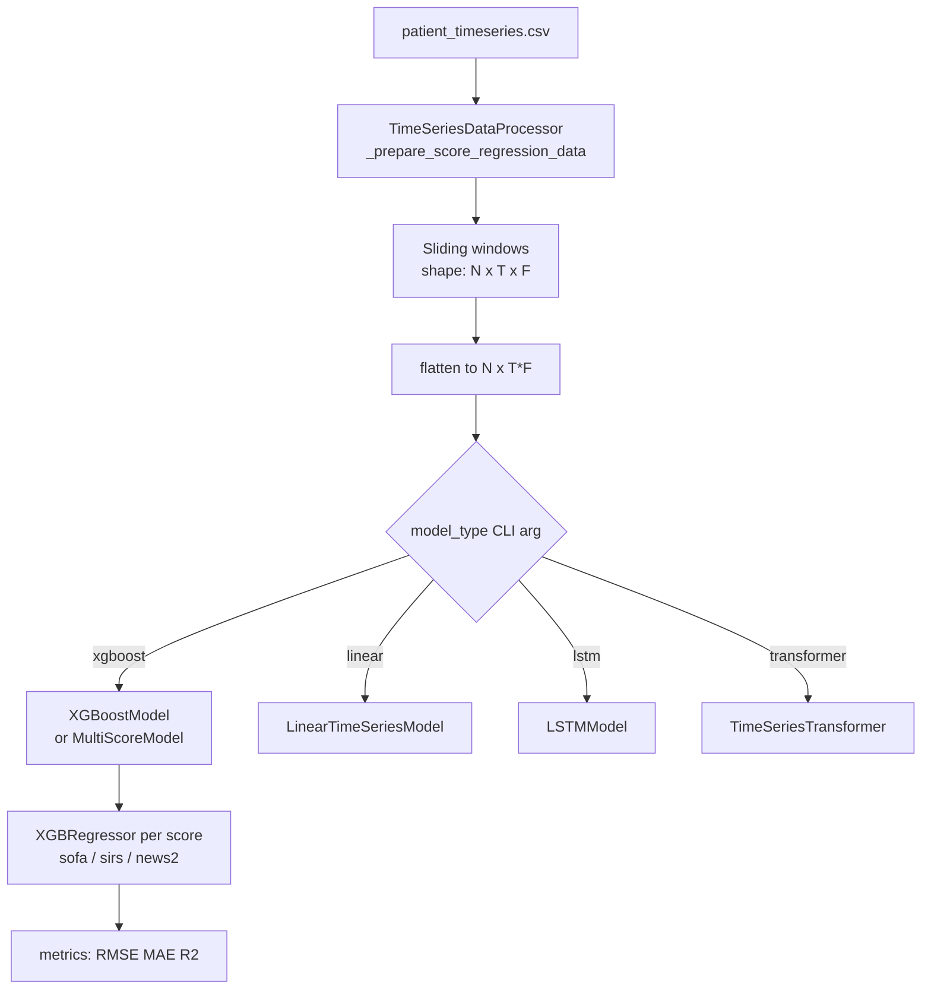

# XGBoost Score Prediction Model — Design Plan

## Objective

Add an XGBoost-based model that predicts **SOFA, SIRS, and NEWS2 scores** using sliding windows from the patient timeseries, following the same interface contract as the existing [`LinearTimeSeriesModel`](../src/linear_model.py) and [`LSTMModel`](../src/lstm_model.py).

---

## Architecture Overview



---

## File Changes

### 1. New file: `src/xgboost_model.py`

Two classes:

#### `XGBoostModel`
- **Interface**: identical to `LinearTimeSeriesModel` — `fit(X, y)`, `predict(X)` where `X` has shape `(N, T, F)`
- Internally flattens `(N, T, F)` → `(N, T*F)` before passing to XGBoost (same as linear model)
- Supports `task_type='regression'` (for score tasks) and `task_type='classification'` (for binary tasks like sepsis onset)
- Wraps `xgboost.XGBRegressor` or `xgboost.XGBClassifier`
- Key constructor hyperparameters (all with sensible defaults):
  - `n_estimators` (default 300)
  - `max_depth` (default 6)
  - `learning_rate` (default 0.05)
  - `subsample` (default 0.8)
  - `colsample_bytree` (default 0.8)
  - `random_state` (default 42)
  - `n_jobs` (default -1)
  - `early_stopping_rounds` (default None — keeps it simple)

#### `MultiScoreModel`
- Thin wrapper that holds **three** `XGBoostModel` instances (one per score: sofa, sirs, news2)
- `fit(train_df)` — calls `TimeSeriesDataProcessor` for each score internally
- `predict(val_df)` → returns dict `{'sofa_score': arr, 'sirs_score': arr, 'news2_score': arr}`
- Useful for running all three scores in one call from a script or notebook
- Also extensible: accepts a `model_factory` callable so any backend (XGBoost, Linear, LSTM) can be swapped in

---

### 2. Updated: `src/benchmark.py`

#### `run_benchmark()` changes
- Add `'xgboost'` to the `elif model_type == ...` chain (lines 203–228)
- Pass XGBoost-specific hyperparameters through to `XGBoostModel.__init__`
- No batch_size needed for XGBoost — falls through the same `else` branch as `linear`

#### `argparse` additions
```
--model_type     choices: linear | lstm | transformer | xgboost  (default: lstm)
--xgb_n_estimators    int   default 300
--xgb_max_depth       int   default 6
--xgb_learning_rate   float default 0.05
--xgb_subsample       float default 0.8
--xgb_colsample       float default 0.8
```

---

## Interface Contract (all models must satisfy)

| Method | Signature | Notes |
|--------|-----------|-------|
| `fit` | `fit(X: np.ndarray, y: np.ndarray) -> None` | X shape `(N, T, F)` |
| `predict` | `predict(X: np.ndarray) -> np.ndarray` | returns `(N,)` array of scores or probs |

This means any future model (e.g. CatBoost, LightGBM, RandomForest) only needs to implement these two methods to plug into `benchmark.py`.

---

## Suggested Usage

```bash
# Single score regression with XGBoost
python src/benchmark.py \
  --task sofa_score \
  --model_type xgboost \
  --prediction_horizon 6 \
  --xgb_n_estimators 300 \
  --xgb_max_depth 6 \
  --data_path processed_files/patient_timeseries_<date>.csv

# Run all three scores comparison: linear vs xgboost
for TASK in sofa_score sirs_score news2_score; do
  for MODEL in linear xgboost; do
    python src/benchmark.py --task $TASK --model_type $MODEL --prediction_horizon 6
  done
done
```

---

## Extension Points

- **Swap model backend**: pass a `model_factory` to `MultiScoreModel` to use LightGBM, CatBoost, etc.
- **Feature importance**: `XGBoostModel` can expose `feature_importances_` after fit for interpretability
- **Probability output for classification**: `XGBClassifier.predict_proba()` — same pattern as `LogisticRegression` in `LinearTimeSeriesModel`
